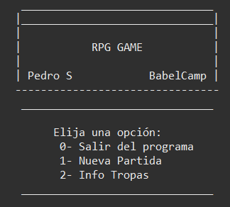

# BABELCamp 7.0  

## Pedro Sánchez Escribano  

**Descripcion**  
 
Repositorio dedicado a las diferentes prácticas realizadas en el BABELCamp de 2022 que imparte [Babel](https://www.babelgroup.com/)

## [git_00](https://github.com/psanchez1095/BABELCamp_PedroSanchezEscribano/tree/master/git_00)  

***Ejercicio 1***

Manejo de git

## [01_HTML](https://github.com/psanchez1095/BABELCamp_PedroSanchezEscribano/tree/master/01_HTML)    

***Ejercicio 2***

Hacer una web con HTML que incluya la mayoria de los componente HTML vistos 
(tablas, imagenes, enlaces, formularios HTML5, etc). La temática puede ser de cualquier tipo
(comercio electronico, ocio, deporte, etc).

La web debe de tener al menos 2 páginas.

## [02_HTML_CURRICULUM](https://github.com/psanchez1095/BABELCamp_PedroSanchezEscribano/tree/master/02_HTML_CURRICULUM)    

***Ejercicio 3***

Hacer el CV en HTML y CSS

***Hecho con diseño responsive***  

## [03_PROYECTO_WEB_ECLIPSE](https://github.com/psanchez1095/BABELCamp_PedroSanchezEscribano/tree/master/03_PROYECTO_WEB_ECLIPSE)    

***Ejercicio 4***

Hacer un proyecto web con Java con una página principal.

La página principal hará una pequeña presentación y tendrá enlaces al ejercicio 2 y al ejercicio 3

## [04_PROYECTO_WEB_ECLIPSE](https://github.com/psanchez1095/BABELCamp_PedroSanchezEscribano/tree/master/04_PROYECTO_WEB_ECLIPSE)    

***Ejercicio 5***

Hacer una aplicación web con java que tenga una pantalla inicial de login.

La aplicación validará el usuario y el password con una lista predefinida con 3 objetos
usuario (clase usuario).

Si el usuario y el password coincide con algun usuario de la lista, entonces la aplicación
mostrará una página de bienvenida mostrando el nombre el usario. En caso contrario mostrará una página 
de error con un enlace a la pagina de login.

**Ampliación** 
Meter un fichero css donde apliquéis algunos estilos.
En la página de bienvenida poner enlaces a la página web del ejercicio 1 y del CV (Copiar las paginas y 
los estilos).

***Todas las páginas estan hechas con un diseño responsive excepto las referentes a GamingWorld*** 

## [05_PROYECTO_WEB_JS](https://github.com/psanchez1095/BABELCamp_PedroSanchezEscribano/tree/master/05_PROYECTO_WEB_JS)    

***Ejercicio 6a***

Hacer una pagina html que nos permite agregar numeros a un array. Además la pagina nos permitirá mediante otro botón, sacar un número aleatorio de los numeros que hemos agregado al array. Se pide que no podamos meter vacios en el array (validar esta parte con JS).

* array.html
* array.js
* array.css

***Ejercicio 6b***

Hacer una pagina html que simule una calculadora. Tendrá 2 input text para poner 2 números y un input text
para sacar el resultado. Tendra 4 botones con las operaciones basicas, y cada vez que pulsemos uno, nos mostrará
el resultado.

* calculadora.html
* calculadora.js
* calculadora.css

## [06_PROYECTO_WEB_TYPESCRIPT](https://github.com/psanchez1095/BABELCamp_PedroSanchezEscribano/tree/master/06_PROYECTO_WEB_TYPESCRIPT)    

***Ejercicio 7***

1. Un alumno desea saber cual sera su calificacion final en la materia de 
JS. Dicha calificacion se compone de los siguientes porcentajes:
    * 55% del promedio de sus tres calificaciones parciales.
    * 30% de la calificacion del examen final.
    * 15% de la calificacion de un trabajo final.

2. Crear un array con varios nombres de videojuegos, imprimir todos los
videojuegos menos los videojuegos con el nombre de "mario"

3. Crea una aplicacion que dado un número, calcule su factorial

* Podeis hacer los tres ejercicios sobre el mismo fichero.ts

* Crearos el fichero tsconfig.json y hacer que se compile automáticamente.

* Compilarlo con la version es6

## [07_PROYECTO_WEB_TYPESCRIPT](https://github.com/psanchez1095/BABELCamp_PedroSanchezEscribano/tree/master/07_PROYECTO_WEB_TYPESCRIPT)    

***Ejercicio 8***

* Crear un sistema de clases que codifique un modelo de un equipo de futbol con sus jugadores
y el historia.

1.    La clase Jugador tiene un id, nombre, una edad y un país de procedencia
2.    La clase Equipo tiene un id, nombre y una fecha de fundación
3.    La clase Historial tiene un id, numero de goles marcados, un número de tarjetas amarillas 
y un número de tarjetas rojas

* Se tendrán en cuenta las siguientes relaciones entre las clases

1.    La clase Equipo podrá tener varios jugadores asociados
2.    La clase Jugador tiene un solo Historial

Se pide hacer el modelo de clases y crear los objetos necesarios para hacer un equipo. 
(no hace falta hacer los 11 jugadores con sus 11 historiales...)

## [08_PROYECTO_WEB_ANGULAR](https://github.com/psanchez1095/BABELCamp_PedroSanchezEscribano/tree/master/08_PROYECTO_WEB_ANGULAR)    

***Ejercicio 9***

Hacer una aplicación angular que muestre el CV que habéis hecho en actividades anteriores.
En este caso, la información más relevante del CV se tiene que poner como atributos
en el componente y mandar la información a la página web, no se deben de poner en la página html
directamente.

## [09_PROYECTO_WEB_ANGULAR_CALCULADORA](https://github.com/psanchez1095/BABELCamp_PedroSanchezEscribano/tree/master/09_PROYECTO_WEB_ANGULAR_CALCULADORA)    

***Ejercicio 10***

Hacer una aplicación angular que muestre la [calculadora](https://github.com/psanchez1095/BABELCamp_PedroSanchezEscribano/tree/master/05_PROYECTO_WEB_JS) que hicimos en actividades anteriores.

## [10_PROYECTO_WEB_ANGULAR_FORM](https://github.com/psanchez1095/BABELCamp_PedroSanchezEscribano/tree/master/10_PROYECTO_WEB_ANGULAR_FORM)    

***Ejercicio 11***

Hacer una aplicacion en angular que de de alta objetos de tipo videojuego. Los videojuegos tendran
un identificador, un titulo, una compañia y una valoración media. 

La app mostrará un formulario para introducir los datos, además permitira vaciar el formulario.

Debajo del formulario se mostrará una tabla con los videojuegos introducidos.

Meter para ambas aplicaciones estilos (ej: reponsive, estilos de formulario, posicionamiento) //20% del tiempo max

Opcional: dar de baja y modificar videojuego.

## [11_PROYECTO_WEB_ANGULAR_ROUTING_COMPONENT_INTERACTION](https://github.com/psanchez1095/BABELCamp_PedroSanchezEscribano/tree/master/11_PROYECTO_WEB_ANGULAR_ROUTING_COMPONENT_INTERACTION)    

***Ejercicio 12***

**Hacer una aplicacion en Angular que muestre un listado-detalle de Videojuegos.**

* Los videojuegos tendran un identificador, un titulo, una compañia, un icono/imagen y una valoración media.

* Para entrar en la página deberemos de estar registrados, se mostrará una página de login al principio
donde deberemos de poner nuestro usuario y nuestro password. La aplicación tendrá algunos usuarios por
defecto.

* En caso de que podamos entrar en la aplicación se mostrará una página con nuestro nombre de usuario y 
el listado de videojuegos (tendremos algunos videojuegos ya dados de alta), pero solo se mostrará en el 
listado el identificador, el icono/imagen y el titulo.

* Si pulsamos en un videojuego, nos llevará a su detalle, el cual podremos ver todos los atributos del 
videojuego. Esta pagina tendrá tambien un boton para volver.

* En caso de que no podamos entrar en la página, se nos mostrará otra vez la pagina de login diciendo que
no hemos podido acceder. Debemos de distinguir si no hemos podido porque el usuario no existe o porque
hemos puesto mal el password. Si no hemos puesto el nombre el password, tambien nos debera avisar.

* La pagina web tendra tambien una página que muestre los datos para contactarnos y otra pagina que hable sobre
nosotros. A estas páginas accederemos mediante un menu de navegación (tambien en este menu tendremos el 
listado de videojuegos)

* Se deben hacer estilos en la aplicación, aplicar routing en todas las paginas y aplicar comunicación 
entre componentes.

## [12_PROYECTO_JAVA_INHERITANCE](https://github.com/psanchez1095/BABELCamp_PedroSanchezEscribano/tree/master/12_PROYECTO_JAVA_INHERITANCE)    

***Ejercicio 13***

HERENCIA

 En una empresa hay tres tipos de empleados, todos con dos atributos comunes, el
 NOMBRE y la SUELDO BASE.

 Los tipos son los siguientes:
1. Directivos
    * Tienen a empleados a su cargo
2. Jefes
    * Tienen unos incentivos
3. Trabajadores
    * Valoracion (1-10) 	

 A todos los empleados se les puede calcular el sueldo final pero a 
 cada uno se le calcula el sueldo en función de ciertas reglas
* El sueldo de los directivos es su sueldo base + el numero de empleados a su cargo multiplicado
 	por 100
* El sueldo de los Jefes es su sueldo base + sus incentivos
* El sueldo de los trabajadores es su sueldo base + un extra en funcion a su valoracion.
	* 0-4 : +0
	* 5-6 : + 50
	* 7-8 : + 100
	* 9-10: + 200
			
Se pide

1. Diseñar el modelo de clases (ojo con la herencia, polimorfismo, etc)
2. El programa creara 3 trabajadores, 2 jefes y un director. Se le darán a cada empleado
los valores que se estimen. El director tendrán al menos 3 empleados a su cargo.
3. Se meterán a los empleados en un array que se recorrerá calculando el salario de cada uno de ellos
	simplemente recorriendolo y ejecutando su metodo.

## [13_PROYECTO_JAVA_BBDD_MANAGEMENT](https://github.com/psanchez1095/BABELCamp_PedroSanchezEscribano/tree/master/13_PROYECTO_JAVA_BBDD_MANAGEMENT)    

***Ejercicio 14***

Ejercicio de hace la entidad coches para trabajar con ella en BBDD:

Los coches tendrán las siguientes atributos
* id
* matrcula;
* marca
* modelo
* kilometros

Se mostrará un menu con las siguientes opciones:

1. Alta de coche
2. Eliminar coche por id
3. Modificar coche por id
4. buscar coche por id
5. buscar coche por matricula
6. buscar coches por marca
7. buscar coches por modelo
8. listar todos los coches
9. Salir de la aplicación

Tendremos las siguientes reglas de negocio

* La matricula tendrá una longitud de 7
* No puede haber dos matriculas repetidas
* Los kilometros no podrán ser negativos

Hacerlo mediante el modelo de las 3 capas que hemos visto en clase

## [14_PROYECTO_JAVA_VIDEOJUEGO_RPG](https://github.com/psanchez1095/BABELCamp_PedroSanchezEscribano/tree/master/14_PROYECTO_JAVA_VIDEOJUEGO_RPG)    

***Ejercicio 15***

Trabajar con el Videojuego 

1. Podemos tener varias tipos de personajes (Mago,Guerrero,Curanderos)
2. Todos podran tener un arma y un nombre, ademas tendran unos puntos
de vida y un atributo especifico, los magos tendran inteligencia, los
guerreros tendran fuerza y los Curanderos tendran Sabiduria
3. Habra diferentes tipos de armas, Espadas, Arcos, Hechizos y Rezos,
cada arma hara un daño especifico. Las espadas y arcos
seran armas que los guerreros usen mejor, los magos usaran de mejor 
manera los hechizos, mientras que los curanderos usaran mejor los
Rezos.
4. Los personajes podran atacar a otro personaje, y cuando le ataque
le restara una vida equivalente al daño del arma, pero si usa un arma
de su tipo especial, además le add un daño equivalente al valor de su 
atributo especial
5. La clase main creara dos personajes, y los enfrentara entre ellos
por turnos en un combate, el combate acabará cuando uno de los dos muera, es decir
sus puntos de vida sean inferiores a 0. Se mostrará el vencedor

* Opciones add: 

	* Se puede implementar un sistema de criticos (doble daño en algunos casos al azar)
	* Los personajes tienen hablidades especiales cuando usan sus armas favoritas
		(Ej, los curandores se curan cuando usan rezos)
	* En vez de un daño fijo, un daño maximo y un daño minimo

## [15_PROYECTO_JAVA_THREADS](https://github.com/psanchez1095/BABELCamp_PedroSanchezEscribano/tree/master/15_PROYECTO_JAVA_THREADS)    

***Ejercicio 16***

Trabajar con hilos en Java

**El calculo de numeros primos es una tarea complicada y costosa de hacer porque puede llevar mucho tiempo de procesamiento**

* Queremos hacer un programa que pida 3 numeros por pantalla y nos diga si son primos o no.

Pero dado que el calculo del numero primo puede ser muy costoso, queremos abrir un hilo de
ejecución por cada numero introducido. Cada hilo recibira el numero que ha introducido el 
usuario por pantalla, y mostrará si es primo o no.

## [16_PROYECTO_JAVA_VIDEOJUEGO_FORTALEZA](https://github.com/psanchez1095/BABELCamp_PedroSanchezEscribano/tree/master/16_PROYECTO_JAVA_VIDEOJUEGO_FORTALEZA)    

***Ejercicio 17***

Hacer una batalla en una fortaleza de unos personajes (magos, guerreros, etc) contra un jefe final.

* Cada personaje sera un hilo que irá a atacar al jefe a la fortaleza. Solo un personaje podra entrar 
a la vez a la fortaleza a atacar al jefe, ambos se atacaran hasta que muera el personaje o 
muera el jefe. El jefe es especialmente duro por lo que costará matarle. 
En caso de que el personaje muera, el siguiente personaje entrara en la fortaleza 
para intentar derrotarle.

* En caso de que el jefe muera, el campeon sera vitoreado y aclamado por su publico y el 
resto de los personajes que queden por combatir ya no podran hacerlo.

* Para la implementacion se pedira que se lancen los hilos personajes a la vez y que entren en 
la fortaleza a matar al jefe final, pero solamente uno podrá entrar en la fortaleza al mismo 
tiempo, por lo que se debe sincronizar el objeto fortaleza para que solo un personaje 
pueda entrar a la vez.

## [17_PROYECTO_JAVA_CONCEPTOS_JAVA8](https://github.com/psanchez1095/BABELCamp_PedroSanchezEscribano/tree/master/17_PROYECTO_JAVA_CONCEPTOS_JAVA8)    

***Ejercicio 18***

**Similar al ejercicio 16 pero con funciones Lambda**

El calculo de numeros primos es una tarea complicada y costosa de hacer porque puede
llevar mucho tiempo de procesamiento;

Queremos hacer un programa que pida 3 numeros por pantalla y nos diga si son primos o no.

Pero dado que el calculo del numero primo puede ser muy costoso, queremos abrir un hilo de
ejecución por cada numero introducido. Cada hilo recibira el numero que ha introducido el 
usuario por pantalla, y mostrará si es primo o no.

* HACERLO CON FUNCIONES LAMBDA. A un objeto de tipo Thread se le puede pasar por parametros de 
constructor una función lambada (runnable es una interfaz funcional)

* Quiero que todo este en la clase main y no haya otras clases.

## [18_PROYECTO_JAVA_CONCEPTOS_JAVA8_2](https://github.com/psanchez1095/BABELCamp_PedroSanchezEscribano/tree/master/18_PROYECTO_JAVA_CONCEPTOS_JAVA8_2)    

***Ejercicio 19***

* Quiero que hagáis una interfaz que os permmita operar con 2 numeros y devuelva un valor.

A partir de esta interfaz, realizar las 4 operaciones basicas que podemos hacer con los numeros
(suma, resta, multiplicacion, division). Ademas realizar la potencia de ambos numeros.

* Para todos los casos deberemos usar las funciones lambda.

* Opcional: Parametrizar los tipos de numero en la interfaz (double, integer)

## [19_PROYECTO_JAVA_MAVEN](https://github.com/psanchez1095/BABELCamp_PedroSanchezEscribano/tree/master/19_PROYECTO_JAVA_MAVEN)    

***Ejercicio 20***

**Similar al ejericico 14 pero usando Maven**

Los coches tendrán las siguientes atributos
* id
* matricula;
* marca;
* modelo;
* kilometros;

Se mostrará un menu con las siguientes opciones:

1. Alta de coche
2. Eliminar coche por id
3. Modificar coche por id
4. buscar coche por id
5. buscar coche por matricula
6. buscar coches por marca
7. buscar coches por modelo
8. listar todos los coches
9. Salir de la aplicación
10. Exportar los coches a un fichero en formato JSON
11. Exportar los coches a un fichero excel (o PDF)
	https://github.com/fdepablo/WorkspaceJava/tree/master/30_Maven

Tendremos las siguientes reglas de negocio

La matricula tendrá una longitud de 7
No puede haber dos matriculas repetidas
Los kilometros no podrán ser negativos

Hacerlo mediante el modelo de las 3 capas que hemos visto en clase

# OTROS  

## TOMCAT  

He añadido el Tomcat para que no se desajusten las rutas al importar el proyecto.